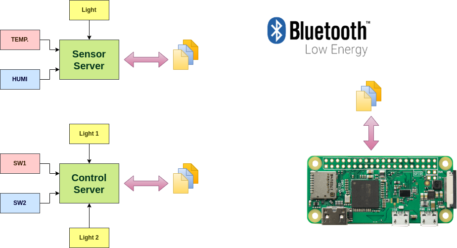
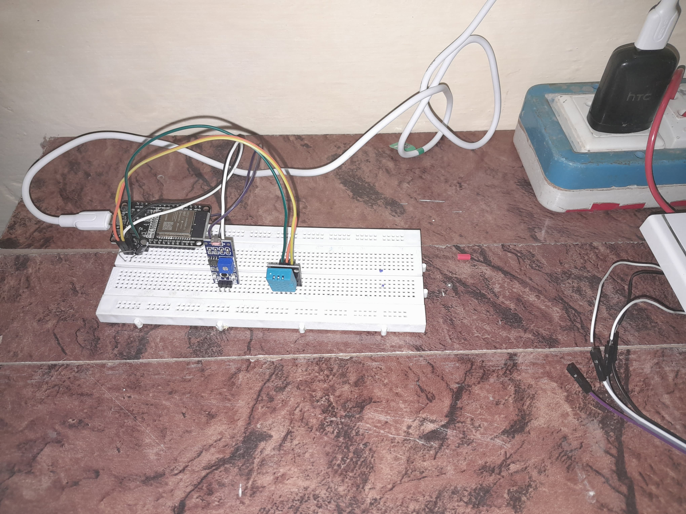
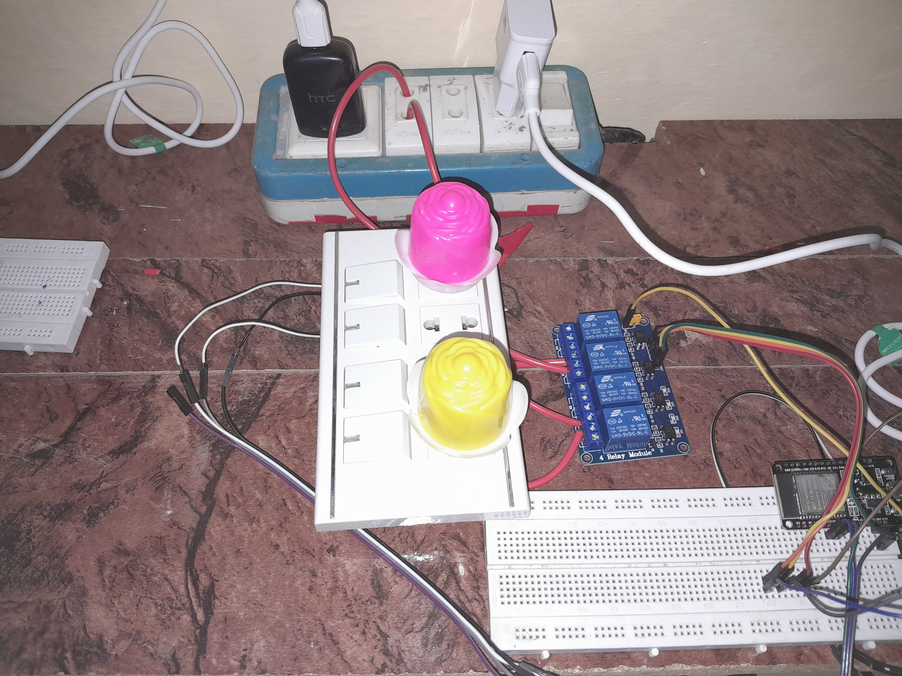
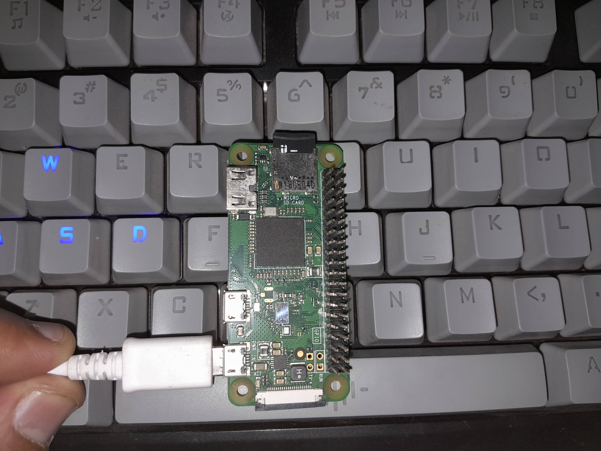

# Proof-of-Concept Demonstration

## Setup

###  ESP32-S1  (Server 1)

Basically a sensor device. Integrates a DHT-11 temperature, humidity sensor and an analog light sensor. The ESP32 advertises a BLE GATT server profile and allows connection with Raspberry pi Client against known UUIDs.

Temp, Humi and Light intensity, each has a unique GATT chracteristic.The system is powered by a micro-USB power adapter.



###  ESP32-S2  (Server 2)

Primarily acts as a relay controlling device. The GPIOs connect to a relay board. The resistors are for current limiting to keep ESP32 in safe operational range.The Relay board connects to a household Wall Switch board that has AC Bulbs for indication.



Moreover, the pushbuttons emulate user actions against switches. (Demo Alternative until current sensors arrive).

The system is powered by power adapter directly from the socket.


### Raspberry pi Zero W Central Client

Pi Zero W acts as a central client. (Pi-5 is not in use because of missing accessories.)

It runs a python program with root permissions. Makes use of bluepy library for bluetooth Communication profiles.
The UUIDs and MAC addresses of server devices are already stored in the program.



### Wireless Access Point

Not neccessary but helps access the pi thorugh SSH for convenient configuration. Eventually, would allow for WAN connection to mobile app.

## Operation
This demonstration includes a sensor server and a control server. The wireless communication is implemented using BLE GATT standard communication protocol.

At the boot-up, the servers wait for the central client to connect. At this time, a blue LED on ESP32 is turned ON. The Raspberry pi client connects to servers using their MAC addresses that are pre-defined in the client application.

After successful pairing, Sensor Service reads the sensor data and transmits a GATT Chracterisitic for each field. Raspberry Pi reads the chracteristics and asserts the control signals accordingly.

In this demo, one of the switch is dedicated to controlling yellow light. This presents the complete process of rpi client reading the switch through ESP32 and triggering the relay to turn ON. The Pink Light is triggered by an LDR. Whenever it finds the light is indufficient, it turns on the light. This demonstrated a sensor based decision.


### Operational Range

Using the BLE GATT channel with ESP32 connected to my Phone, I experienced a very good range of ~11 meters (apologies: 15 in the video was an approximate measurement). In case of ESP32 connected to raspberry pi zero w over BLE 4.2 GATT, I experienced the range dropping at ~4-5 meters.(BLE + WiFi active). So clearly, RPi is the bottleneck.

### Log (rpi console)

```
aitesam961@latitude:~$ ssh pi0wh@192.168.8.102
pi0wh@192.168.8.102's password: 
Linux raspberrypizero 6.1.0-rpi8-rpi-v6 #1 Raspbian 1:6.1.73-1+rpt1 (2024-01-25) armv6l

The programs included with the Debian GNU/Linux system are free software;
the exact distribution terms for each program are described in the
individual files in /usr/share/doc/*/copyright.

Debian GNU/Linux comes with ABSOLUTELY NO WARRANTY, to the extent
permitted by applicable law.
Last login: Thu Feb 15 13:28:32 2024 from 192.168.8.107
pi0wh@raspberrypizero:~ $ cd bleapp
pi0wh@raspberrypizero:~/bleapp $ ls
blecclient.py  blehandshake.py  bleserial.cpp  bleserial.py  readme.md
pi0wh@raspberrypizero:~/bleapp $ sudo python3 blecclient.py
Waiting for sensor notifications...
Temperature: 18 °C
Humidity: 43 %
Light Status: 0
Switch 1: 0
Switch 2: 1
Light 1 turned: ON
Light 2 turned: ON
Waiting for sensor notifications...
Temperature: 18 °C
Humidity: 43 %
Light Status: 1
Switch 1: 0
Switch 2: 1
Light 1 turned: OFF
Light 2 turned: ON
Waiting for sensor notifications...
Temperature: 18 °C
Humidity: 43 %
Light Status: 1
Switch 1: 0
Switch 2: 1
Light 1 turned: OFF
Light 2 turned: ON
Waiting for sensor notifications...
Temperature: 18 °C
Humidity: 43 %
Light Status: 1
Switch 1: 0
Switch 2: 1
Light 1 turned: OFF
Light 2 turned: ON
Waiting for sensor notifications...
Temperature: 19 °C
Humidity: 44 %
Light Status: 1
Switch 1: 0
Switch 2: 1
Light 1 turned: OFF
Light 2 turned: ON
Waiting for sensor notifications...
Temperature: 19 °C
Humidity: 44 %
Light Status: 0
Switch 1: 0
Switch 2: 1
Light 1 turned: ON
Light 2 turned: ON
Waiting for sensor notifications...
Temperature: 19 °C
Humidity: 44 %
Light Status: 1
Switch 1: 0
Switch 2: 1
Light 1 turned: OFF
Light 2 turned: ON
Waiting for sensor notifications...
Temperature: 19 °C
Humidity: 44 %
Light Status: 0
Switch 1: 0
Switch 2: 1
Light 1 turned: ON
Light 2 turned: ON
Waiting for sensor notifications...
Temperature: 19 °C
Humidity: 44 %
Light Status: 1
Switch 1: 0
Switch 2: 1
Light 1 turned: OFF
Light 2 turned: ON


```
### Summary

This is the proof-of-concept demonstration of the system working with basic features as reading from sensors and toggling light switches.
Several improvements and additions have yet to be made. However, this demonstration presents an end-to-end system operation with complete software stack implementation following the hard standards and best design practices.
More functionalities have yet to come.
